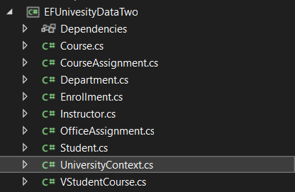

# Challenge One
## Way One
1. I create two projects, the first is the EFUniveristyDomain which has the DB Tables definitios on it. I have to install `Microsoft.EntityFrameworkCore.SqlServer` library. The other project is the EFUniversityData which has the UniversityContext.
   

2. I create the class PersonBaseDomain, which is an abstract class, and has the property ID, LastName, FirstMidName so student and Instructor and use that properties and add more. 

3. In the EFUniveristyDomain project I create the following classes based on the DB tables.
      * Student
      * Instructor
## Way Two
I can create the context of the DB with a reverse engineer of the database. Using the next command:
`Scaffold-Dbcontext -provider Microsoft.EntityFrameworkCore.SqlServer -connection "Data Source=LAPTOP-KAP3NP1H; Initial Catalog=University; persist security info=True; Integrated Security=SSPI;"`

This will create the table classes and the University context. 
